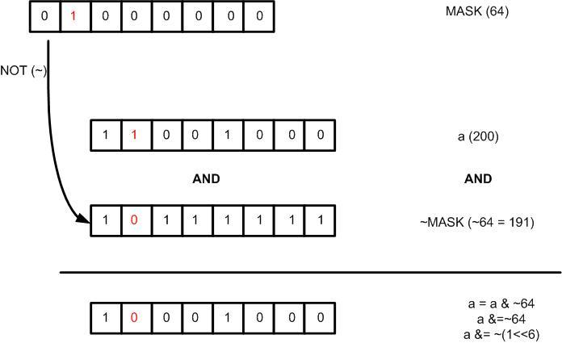
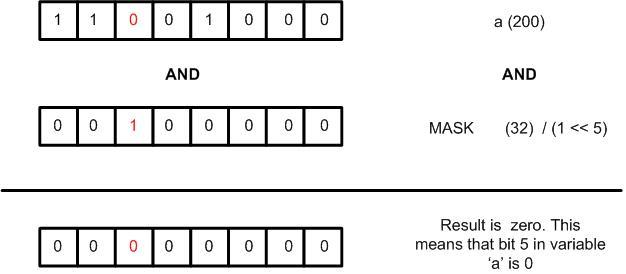

+++
author = "Hussam Al-Hertani"
title = "Bit Manipulation in C Part II - Read Modify Write Operations"
date = "2024-06-02"
draft = false
description = "Bit Manipulation Basics in C"
[params]
  math = true
tags = [
    "C",
]
categories = [
    "C",
]
+++


This article covers Read Modify Write (RMW) operations. These operations
allow the programmer to manipulate one or more bits of interest within a
variable (or register), without affecting the state of the rest of the
bits in the that variable (or register). In order to understand RMW
operations, the reader must have a solid foundation in bit manipulation.
Bit manipulation basics were covered in the [Bit Manipulation in C Part 1 - Bit Manipulation basics]() 
blog entry.


There are four main RMW operations:

-   Setting one or more bits in a register.
-   Clearing one or more bits in a register.
-   Toggling one or more bits in a register.
-   Reading the value of a particular bit within a register.

For the rest of this blog entry variables and / or registers will be
referred to as registers for brevity. Both refer to locations in memory
where data is stored. The term register is typically used when
referencing memory locations capable of directly affecting hardware
operation of either the CPU or a hardware peripheral.

The reason why these type of operations are often referred to as
**Read-Modify-Write** is because they involve:

1.  **Read**ing the state of the register,
2.  **Modify**ing the state of that register by performing a bitwise
    logical operation on the value read from the register, with a bit
    mask of some kind intending to modify one or more (particular) bits
    within the register , and finally,
3.  **Write**-ing back the result into the same register.

Only the bits of interest are modified by an RMW operation. the state of
the bits that are not of interest within the register never changes.

## Setting one or more bits in a register

The first RMW operation that will be examined is the set operation. The
goal here is to set one or more bit(s) of interest in a register,
without disturbing the state of the other bits that are not of interest.
To achieve this, OR the current content of the register with a mask
value with only one(s) in the bit location(s) to be set and zeroes
elsewhere.

To further elaborate, if the value of a register (or variable) a is 200.
To set bit x in that register, OR a with a mask value of 2^x^.

Consider the following example (See Figure 1.). If the goal is to set
bit 5 in register a, the mask is 2^5^ = 32. The set operation then
becomes:

``` C
a= a | 32;
```

which is equivalent the following compound assignment statement:

``` C
a |= 32;
```

Alternatively 32 can be written as (1 \<\< 5) in C. This mask notation
is easier to read and immediately indicates to the reader/programmer
which bit is being set. The final operation becomes:

``` C
a  |= (1 << 5);
```


In summary to set a bit x in register reg, use the following expression:

``` C
reg |= (1 << x);
```

What if the programmer needs to set more than one bit in register reg,
say bit positions x, y and z?

``` C
reg |= ((1 << x) | (1 << y) | (1 << z));
```

## Clearing one or more bits in a register

The goal here is to clear one or more particular bit(s) in a register,
without disturbing the state of the other bits that are not of interest.
To achieve this, AND the current content of the register with a mask
value with zero(es) in the bit location(s) that we want to clear and
ones elsewhere.

If the value of the register a is 200. To clear bit x in that register,
the content of register a is ANDed with a mask that is the **inverted
(one's complement)** value of 2^x^.

For example, if the goal is to clear bit 6. the mask becomes the one's
complement of 2^6^ = 64 which results in 191. Therefore to clear bit 6
in register a:

``` C
a= a & 191;
```

which is equivalent to the following compound assignment statement

``` C
a &= 191;
```

Alternatively 191 can be written as \~(1 \<\< 6) in C. This mask
notation is much more readable as it indicates to the reader/programmer
which bit is being cleared without having to resort to doing decimal to
binary conversion.

``` C
a  &= ~(1 << 6);
```



In summary, to clear a bit x in register reg use the following
expression:

``` C
reg &= ~(1 << x);
```

What if the programmer needs to clear more than one bit in register reg,
say bits x, y and z ?

``` C
reg &= ~((1 << x) | (1 << y) | (1 << z));
```

## Toggling one or more bits in a register

The goal here is to toggle one or more particular bit(s) in a register,
without disturbing the state of the other bits that are not of interest.
To achieve this, XOR the current content of the register with a mask
value with one(s) in the bit locations to be toggled and zeroes
elsewhere.

For example if the value of a register a is 200, to toggle bit 'x' in
that register, one will need to XOR a with a mask value of 2^x^.

To further elaborate, If the goal is to toggle bit 5 in register a, the
mask is 2^5^ = 32. The set operation then becomes:

``` C
a= a ^ 32 ; 
```

which is equivalent to

``` C
a ^= 32;
```

in shorthand notation. Alternatively 32 can be written as (1 \<\< 5) in
C.

``` C
a ^= (1 << 5);
```

In summary, to toggle a bit x in register reg use the following
expression:

``` C
reg ^= (1 << x);
```

What if the programmer needs to toggle more than one bit in register
reg, say bits x,y and z ?

``` C
reg ^= ((1 << x) | (1 << y) | (1 << z));
```

## Read the value of bit in a registers

To read the value of a bit x in a register `a`, simply AND register `a`
with a mask value of 2^x^ (i.e. all bit positions are 0's except
position x).



If the result is 0 then bit x in register a was 0(cleared). If the
result is non-zero, then bit x in register a was 1(set).


For example to read the state of bit 5 in register **a**:

``` C
uint8_t a , y;
y = a & 32;
if(y == 0 )
  printf("Bit 5 in register a is zero");
else
  printf("Bit 5 in register a is one");
```

In C, a non-zero value evaluates to true so the statement

``` C
if(y)Copy
```

will evaluate to true if 'y' is non-zero. Using this knowledge and
compund assignment notation, the previous code snippet becomes:

``` C
if(a & (1 << 5))
  printf("Bit 5 in register a is one");
else
  printf("Bit 5 in register a is zero");
```

In some cases the programmer will want to return the exact state of the
bit in a register and not a non-zero value when the state of the bit is
one, and zero when the state of the bit is zero. This can be
accomplished with the ternary operator. If bit x in register a is 1, res
will be 1. else res will be zero.

``` C
res = (a & ( 1<< x )) ? 1 : 0 ;
```

Another method of reading the state of a bit x in register a is to use
this statement:

``` C
res = (a >> x) & 1;
```

This shifts the content of register a to the right by x bits, putting
the 'xth' bit to be tested in the zeroth position. It is then ANDed with
one. If this bit is zero, the result of the operation is zero, else it
is one.

In summary to read the state of bit x in register a with an if
statement:

``` C
if(a & (1 << x))
  printf("Bit x in register a is one");
else
  printf("Bit x in register a is zero");
```

If the state of the bit is to be returned without an if statement, use
either

``` C
res = (a & ( 1<< x ) ) ? 1 : 0 ;
```

or

``` C
res = (a >> x) & 1;
```

## Building a bit manipulation library

Now with the knowledge of how RMW operations function, a quick library
that performs these operations can be built!

The macro version should look like this:

``` C
#define m_setBit(reg,x) reg |= (1 << x)
#define m_clearBit(reg,x) reg &= ~(1 << x)
#define m_toggleBit(reg,x) reg ^= (1 << x)
#define m_readBit(reg,x)  (reg >> x) & 1
#define m_readBit2(reg,x) (reg & ( 1<< x ) ) ? 1 : 0
```

If you are not a big fan of macros, the inline function version of the
library would look something like this:

``` C
void setBit(int* reg, int x){      *reg |= (1 << x);}
void clearBit(int* reg, int x){    *reg &= ~(1 << x);}
void toggleBit(int* reg, int x){   *reg ^= (1 << x);}
int  readBit( int* reg, int x){  return (*reg >> x) & 1;}
int  readBit2( int* reg, int x){ return (*reg & ( 1<< x ) ) ? 1 : 0 ;}
```

Note that these macros/functions only modify one bit at a time.

One last thing. The RMW operations introduced in this article are not
strictly atomic i.e. they will very likely not happen in a single
instruction cycle and may even take several instruction cycles to
execute. They merely give us bit granularity i.e. ensure that only the
bits of interest within a register are changed while keeping the state
of bits that are not of interest undisturbed.
