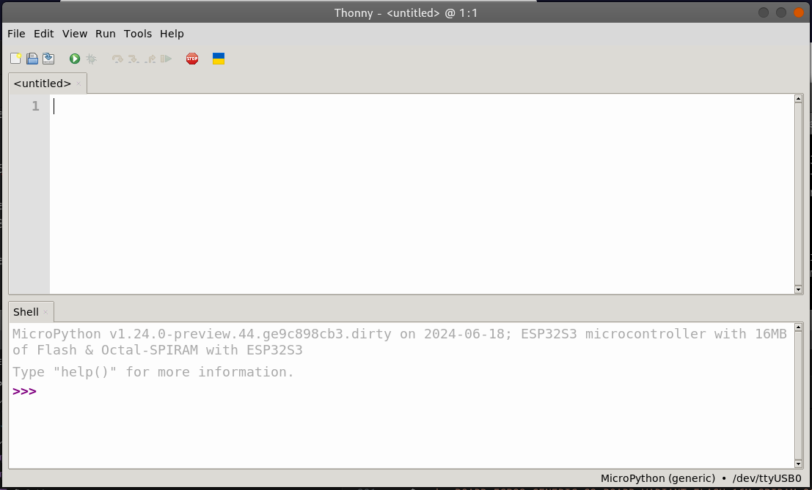
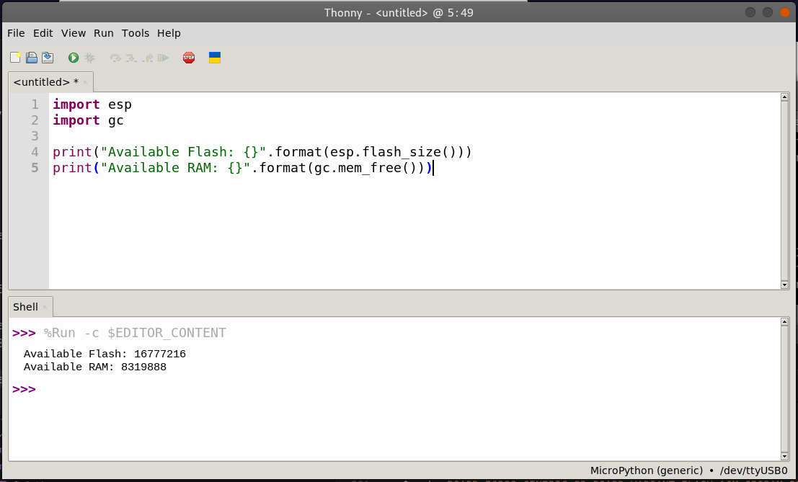

+++
author = "Hussam Al-Hertani"
title = "Building a Micropython Image from source targetting an ESP32-S3 Microcontroller with 16MB of Flash and 8MB SPIRAM"
date = "2024-06-17"
draft = false
description = "ESP32S3 in micropython"
[params]
  math = true
tags = [
    "Micropython", "ESP32"
]
categories = [
    "Micropython", "ESP32"
]
+++

In a [previous blog entry](), the flashing of a pre-built micropython image on the ESP32S3 Devkit-C-v1.1 board was demonstrated sucessfully. Unfortunately the pre-built ESP32S3 Micropython images on the [official Micropython wesbite site](https://micropython.org/download/ESP32_GENERIC_S3/), support up to 8MB of Flash only. But my ESP32S3 Devkit-C-v1.1 board (*ESP32-S3-DevKitC-1-N16R8V*) has 16MB of Flash available; half of which is not detected nor can be used. In order to get Micropython to utilize the entirety of the avalable 16MB of Flash memory, a custom Micropython image must be built from source.

To build a custom Micropython image from source one needs to do the following:
- [Download and Install the ESP-IDF environment and all prerequisites](https://docs.espressif.com/projects/esp-idf/en/stable/esp32s3/get-started/linux-macos-setup.html)
- [Download the Micropython source tree and install all prerequsites](https://github.com/micropython/micropython/tree/master/ports/esp32)
- Add a new board variant (with 16MB flash + octal SPIRAM) for the ESP32-S3 by modifying the **ESP32_GENERIC_S3** board definitions in the Micropython source tree
- Build a custom Micropython image based on this new variant and flash it onto the devkit board.

### Download and Install the ESP-IDF environment and all prerequisites

The instructions for installing the ESP-IDF on a Linux based OS are provided [here](https://docs.espressif.com/projects/esp-idf/en/stable/esp32s3/get-started/linux-macos-setup.html). I will still go through all the steps below.


 Start by installing all prerequisites. For Debian this looks like:
 
 ```Bash
 : $ sudo apt-get install git wget flex bison gperf python3 python3-pip python3-venv cmake ninja-build ccache libffi-dev libssl-dev dfu-util libusb-1.0-0
 ```
 Then download and install the ESP-IDF; the Espressif's C SDK for the ESP32 family. 

```Bash
 
 : $ mkdir -p ~/Development/esp
 : $ cd ~/Development/esp
 : $ git clone -b v5.0.4 --recursive https://github.com/espressif/esp-idf.git
 : $ cd ~/esp/esp-idf
 : $ ./install.sh esp32s3

```

Note that the last command above installs the tools (compiler, debugger e.t.c.) necessary for the esp32s3 only. If you'd like to install tools for the esp32 and say the esp32-c3 let's say, replace that command with `: ~$ ./install.sh esp32s3,esp32,esp32c3`. 
 
 Also make sure that you download a version of the ESP-IDF that's [compatible](https://github.com/micropython/micropython/tree/master/ports/esp32) with Micropython. In this tutorial version 5.0.4 of the ESP-IDF is used.

Once the ESP-IDF SDK is installed, you'll need to load the necessary environment variables to use it:

```Bash
: $ . ~/Development/esp/esp-idf/export.sh
```

### Download the Micropython source tree and install all prerequsites

First download all the necessary prerequisites for a Debian machine:

```Bash

 : $ sudo apt-get install build-essential libreadline-dev libffi-dev git pkg-config gcc-arm-none-eabi libnewlib-arm-none-eabi

```

Next download the micropython source code into the `~/Development` directory containing the `esp/` folder

```Bash

 : $ cd ~/Development
 : $ git clone --recurse-submodules https://github.com/micropython/micropython.git
 
```

Build the MicroPython cross-compiler mpy-cross. It is needed to pre-compile some of the built-in scripts to bytecode.

```Bash
 : $ cd ~/Development/micropython/
 : $ make -C mpy-cross
```

 
 ### Add a new board variant (with 16MB flash + octal SPIRAM) for the ESP32-S3 

 In the Micropython source tree, go to where the ESP32 boards are and cd into the `ESP32_GENERIC_S3` board definition.

```Bash
 : $ cd ~/Development/micropython/ports/esp32/boards/ESP32_GENERIC_S3
 : $ ls -al
```
 You'll find the following files:

- board.json
- board.md
- mpconfigboard.cmake
- mpconfigboard.h
- sdkconfig.board
- sdkconfig.flash_4m

Let's take a look at **board.json**:

```json
{
    "deploy": [
        "../deploy_s3.md"
    ],
    "docs": "",
    "features": [
        "BLE",
        "External Flash",
        "External RAM",
        "WiFi"
    ],
    "images": [
        "generic_s3.jpg"
    ],
    "mcu": "esp32s3",
    "product": "ESP32-S3",
    "thumbnail": "",
    "url": "https://www.espressif.com/en/products/modules",
    "vendor": "Espressif",
    "variants": {
        "SPIRAM_OCT": "Support for Octal-SPIRAM",
        "FLASH_4M": "4MiB flash"
    }
}

```

In the `variants` structure at the bottom let's add a new variant `FLASH_16M_SPIRAM_OCT`.
The **modified board.json** should now look like:

```json
{
    "deploy": [
        "../deploy_s3.md"
    ],
    "docs": "",
    "features": [
        "BLE",
        "External Flash",
        "External RAM",
        "WiFi"
    ],
    "images": [
        "generic_s3.jpg"
    ],
    "mcu": "esp32s3",
    "product": "ESP32-S3",
    "thumbnail": "",
    "url": "https://www.espressif.com/en/products/modules",
    "vendor": "Espressif",
    "variants": {
        "SPIRAM_OCT": "Support for Octal-SPIRAM",
        "FLASH_4M": "4MiB flash",
        "FLASH_16M_SPIRAM_OCT": "16MiB flash with Octal-SPIRAM"
    }
}
```

The next file that needs to be modified is the **mpconfigboard.cmake**. This is what it looks like before modification:

```cmake

set(IDF_TARGET esp32s3)

set(SDKCONFIG_DEFAULTS
    boards/sdkconfig.base
    ${SDKCONFIG_IDF_VERSION_SPECIFIC}
    boards/sdkconfig.usb
    boards/sdkconfig.ble
    boards/sdkconfig.spiram_sx
    boards/ESP32_GENERIC_S3/sdkconfig.board
)

if(MICROPY_BOARD_VARIANT STREQUAL "SPIRAM_OCT")
    set(SDKCONFIG_DEFAULTS
        ${SDKCONFIG_DEFAULTS}
        boards/sdkconfig.240mhz
        boards/sdkconfig.spiram_oct
    )

    list(APPEND MICROPY_DEF_BOARD
        MICROPY_HW_BOARD_NAME="Generic ESP32S3 module with Octal-SPIRAM"
    )
endif()

if(MICROPY_BOARD_VARIANT STREQUAL "FLASH_4M")
    set(SDKCONFIG_DEFAULTS
        ${SDKCONFIG_DEFAULTS}
        boards/ESP32_GENERIC_S3/sdkconfig.flash_4m
    )
endif()

```

We will now add a new `if block` at the bottom of the file for our new variant. The **modified mpconfigboard.cmake** should look like:


```cmake

set(IDF_TARGET esp32s3)

set(SDKCONFIG_DEFAULTS
    boards/sdkconfig.base
    ${SDKCONFIG_IDF_VERSION_SPECIFIC}
    boards/sdkconfig.usb
    boards/sdkconfig.ble
    boards/sdkconfig.spiram_sx
    boards/ESP32_GENERIC_S3/sdkconfig.board
)

if(MICROPY_BOARD_VARIANT STREQUAL "SPIRAM_OCT")
    set(SDKCONFIG_DEFAULTS
        ${SDKCONFIG_DEFAULTS}
        boards/sdkconfig.240mhz
        boards/sdkconfig.spiram_oct
    )

    list(APPEND MICROPY_DEF_BOARD
        MICROPY_HW_BOARD_NAME="Generic ESP32S3 module with Octal-SPIRAM"
    )
endif()

if(MICROPY_BOARD_VARIANT STREQUAL "FLASH_4M")
    set(SDKCONFIG_DEFAULTS
        ${SDKCONFIG_DEFAULTS}
        boards/ESP32_GENERIC_S3/sdkconfig.flash_4m
    )
endif()

if(MICROPY_BOARD_VARIANT STREQUAL "FLASH_16M_SPIRAM_OCT")
    set(SDKCONFIG_DEFAULTS
        ${SDKCONFIG_DEFAULTS}
        boards/sdkconfig.240mhz
        boards/sdkconfig.spiram_oct
        boards/ESP32_GENERIC_S3/sdkconfig.flash_16m
    )

     list(APPEND MICROPY_DEF_BOARD
        MICROPY_HW_BOARD_NAME="ESP32S3 microcontroller with 16MB of Flash & Octal-SPIRAM"
    )
endif()

```

Note that in the `list` section in the last `if` block, defines the name of the board. Ideally you can place whatever you like here. It will override the board name definition in the **mpconfigboard.h** file and will be printed in the Micropython shell when
the board is brought out of reset. 

Now let's take a quick peek at **sdkconfig.flash_4m**:

```
CONFIG_ESPTOOLPY_FLASHSIZE_4MB=y
CONFIG_ESPTOOLPY_FLASHSIZE_8MB=

CONFIG_PARTITION_TABLE_CUSTOM_FILENAME="partitions-4MiB.csv"
```

We will **NOT MODIFY** this file. Instead let's create a new file called **sdkconfig.flash_16m**. We already referenced this file in the modification made to the **mpconfigboard.cmake**. The contents of the new **sdkconfig.flash_16m** should be:

```
CONFIG_ESPTOOLPY_FLASHSIZE_4MB=
CONFIG_ESPTOOLPY_FLASHSIZE_8MB=
CONFIG_ESPTOOLPY_FLASHSIZE_16MB=y

CONFIG_PARTITION_TABLE_CUSTOM_FILENAME="partitions-16MiB.csv"
```
Note that the contents of the **sdkconfig.flash_16m** file are remarkably similar to those of the **sdkconfig.flash_4m**. The modifications include setting the esptool FLASHSIZE variable to 16MB and including the 16MiB partition memory file instead of the 4MiB one. The partition file is already included in the Micropython source tree at `micropython//ports/esp32/partitions-16MiB.csv`.

With these modifications completed, we are now ready to build the image! 

### Build a custom Micropython image based on this new variant 

To build the new micropython image; first load the esp-idf's environment variables then cd into `micropython/ports/esp32` and type the make command

```Bash
: $ . ~/Development/esp/esp-idf/export.sh
: $ cd ~/Development/micropython/ports/esp32
: $ make submodules
: $ make BOARD=ESP32_GENERIC_S3 BOARD_VARIANT=FLASH_16M_SPIRAM_OCT
```

The new custom micropython image files should be available at `~/Development/micropython/ports/esp32/build-ESP32_GENERIC_S3-FLASH_16M_SPIRAM_OCT/`.

to flash our Micropython image onto our ESP32-S3 Devkit microcontroller:

```Bash
: $ esptool.py --chip esp32s3 --port /dev/ttyUSB0 erase_flash
: $ esptool.py -p /dev/ttyUSB0 -b 460800 --before default_reset --after no_reset --chip esp32s3  write_flash --flash_mode dio --flash_size 16MB --flash_freq 80m 0x0 build-ESP32_GENERIC_S3-FLASH_16M_SPIRAM_OCT/bootloader/bootloader.bin 0x8000 build-ESP32_GENERIC_S3-FLASH_16M_SPIRAM_OCT/partition_table/partition-table.bin 0x10000 build-ESP32_GENERIC_S3-FLASH_16M_SPIRAM_OCT/micropython.bin

```

The esptool command for flashing the ESP32S3 module with the custom image is rather long. Thankfully, after the previous make command succeeds in building the image, it prints out the full flash command for you.

Note that because the esp-idf's environment variables were loaded with the `export.sh` command, the terminal should have access to the esptool programmer via the esp-idf SDK without resorting to the use of the Python virtual environment with the esptool installed in it as was done in the [previous blog entry](). 

After resetting the board and opening Thonny we are greeted with the Micropython Shell shown below:



Note that the Micropython shell prints out the board name that we placed in the **mpconfigboard.cmake** file for the 16MB with SPI octal ram variant: *ESP32S3 microcontroller with 16MB of Flash & Octal-SPIRAM*.

Now let's run the following Micropython script to determine how much Flash and Ram is detected:

``` Python

import esp
import gc

print("Available Flash: {}".format(esp.flash_size()))
print("Available RAM: {}".format(gc.mem_free()))

```


The output is provided in the figure above. It seems that our custom Micropython build can now detect and utilize all of our 16MB of Flash memory! Success!

