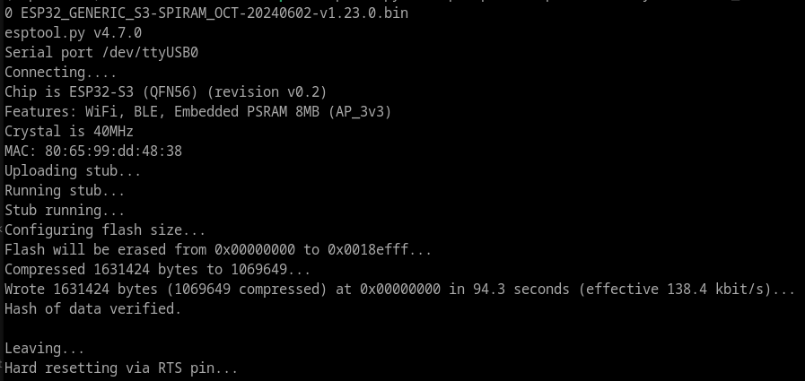
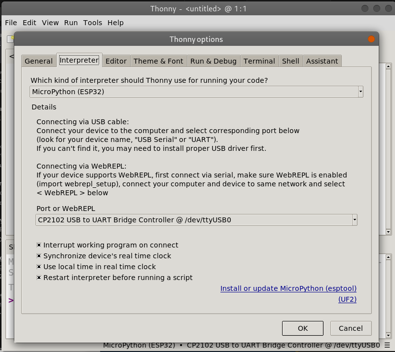
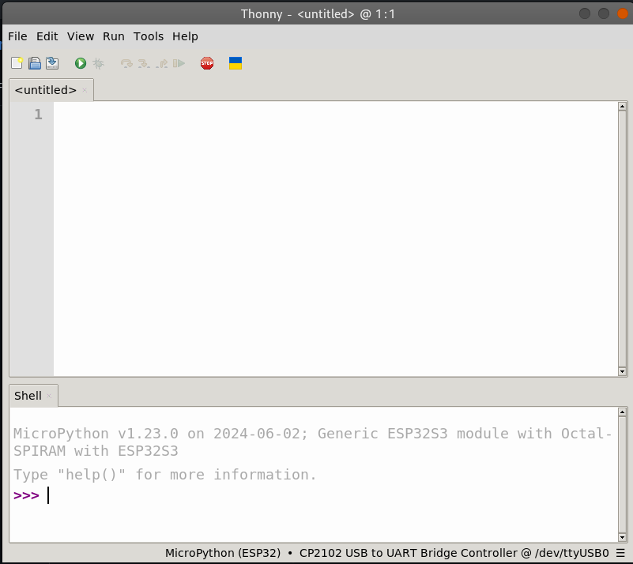
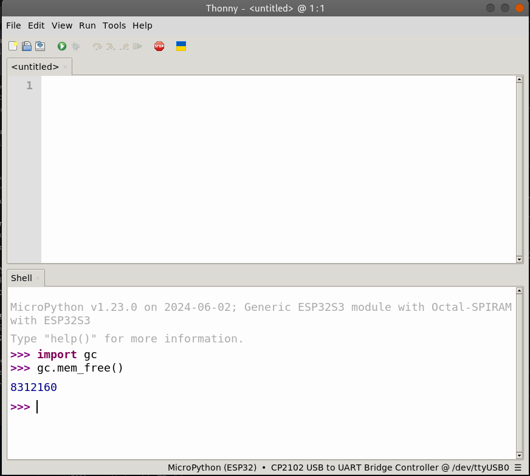
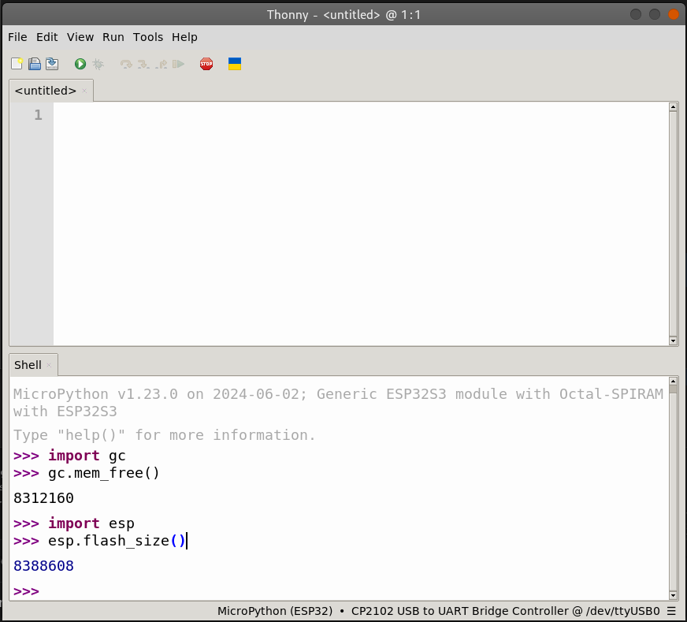

+++
author = "Hussam Al-Hertani"
title = "Flashing MicroPython on the ESP32-S3 Microcontroller"
date = "2024-06-17"
draft = false
description = "ESP32S3 in microPython"
[params]
  math = true
tags = [
    "MicroPython", "ESP32"
]
categories = [
    "MicroPython", "ESP32"
]
+++

I recently purchase an [ESP32-S3-DevKitC-1 v1.1](https://docs.espressif.com/projects/esp-idf/en/stable/esp32s3/hw-reference/esp32s3/user-guide-devkitc-1.html) development board and wanted to program it MicroPython.

I got the *ESP32-S3-DevKitC-1-N16R8V* variant with the [ESP32-S3-WROOM-2-N16R8V](https://www.espressif.com/sites/default/files/documentation/esp32-s3-wroom-2_datasheet_en.pdf) module. This particular module comes with 16MB of octal SPI Flash memory and 8MB of octal SPI PSRAM; plenty of program memory and RAM for all of those MicroPython objects!. In this blog entry, I will list the steps necessary to get MicroPython up and running on this board!


To get started, Download the latest precompiled MicroPython image (Octal-SPIRAM support) from the [official MicroPython download page](https://micropython.org/download/ESP32_GENERIC_S3/).

```bash
:~$ wget https://micropython.org/resources/firmware/ESP32_GENERIC_S3-SPIRAM_OCT-20240602-v1.23.0.bin
```

To flash the image onto the microcontroller board, you'll need the esptool programmer software. There are many ways of installing esptool. Since esptool is a Python application, one way to install it is via Python's package manager *pip*. But you'll need to setup a virtual Python environment first. This can accomplished with the following instruction on Debian Bookworm: 

``` Bash
:~$ mkdir -p ~/Development/PythonVirtEnvironments/
:~$ python3 -m venv ~/Development/PythonVirtEnvironments/EsptoolEnv
```

Now activate the Python virtual environment and install the esptool programmer.

```Bash
:~$ source ~/Development/PythonVirtEnvironments/EsptoolEnv/bin/activate
(EsptoolEnv) :~$ pip install esptool
```

To flash the MicroPython bin file, connect the USB cable to the USB port on the left of the board (the one attached to the UART0 peripheral on the ESP32S3's via the USB-Serial FTDI chip). Make sure that you are using the right port name. In my case that was `/dev/ttyUSB0`. Run the following commands to: i) erase the  ESP32S3 module, & ii) program it with the downloaded binary:

```Bash 
(EsptoolEnv) :~$ esptool.py --chip esp32s3 --port /dev/ttyUSB0 erase_flash
(EsptoolEnv) :~$ esptool.py --chip esp32s3 --port /dev/ttyUSB0 write_flash -z 0 ESP32_GENERIC_S3-SPIRAM_OCT-20240602-v1.23.0.bin
```
You should get the following output:




Now install and run Thonny; an easy to use yet versatile MicroPython IDE:

```Bash
(EsptoolEnv) :~$ pip install thonny
(EsptoolEnv) :~$ thonny
```
Goto `Run->Configure Interpreter` and ensure that the `Interpreter`tab in the `Thonny options` looks as shown below: 




click 'OK' on the dialog and you should be presented with the MicroPython shell at the bottom of the thonny window as shown in the figure below.




To get started, let's see how much PSRAM and Flash are detected in the MicroPython shell. To find out how much PSRAM is detected, type the following:

```Python
import gc

gc.mem_free()
```


Notice that we get `8312160` bytes. This is close enough to the 8MB of PSRAM that we were expecting (`8388608` bytes). The difference is very likely the memory used to launch the MicroPython interpreter.

What about Flash memory ? 

```Python
import esp

esp.flash_size()
```


For Flash, it looks like MicroPython is only able to detect 8 of the available 16 Megabytes. The MicroPython `ESP32_GENERIC_S3` images all seem to support a maximum of 8MB even if the on module Flash memory is more. What a bummer!  I've seen ESP32-S3 boards with as much as 32MB of Flash being sold on Digikey. To be fair, if you purchase the **ESP32-S3-DevKitC-1-N8R8V** variant of the ESP32-S3 Devkit board (with 8MB of Flash and 8MB of PSRAM), this image will be all you need.  

While the prebuilt MicroPython build is fully functional, and the 8MB of Flash memory that it detected on our board will be enough for most projects, the fact that only half the available Flash is detected triggers my OCD a little. In a future entry, I'll demonstrate how to build a MicroPython image from source that supports the 16MB of Flash in its entirety.